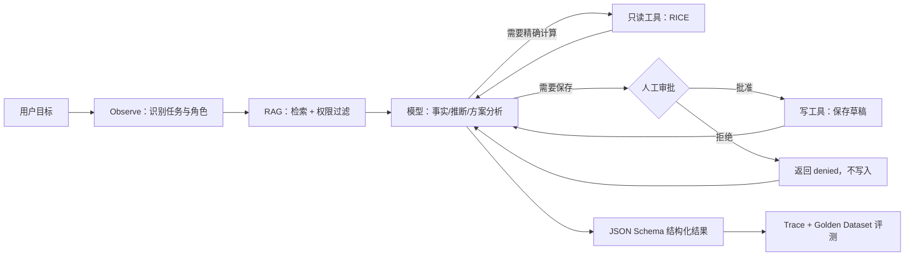

# 产品需求分析 Agent：从 0 到可评测原型

这是一个为 Agent 产品经理新手准备的教学项目。它把工作区已有的“事实—推断—方案—决策”
Prompt，升级成一个可以运行、检索知识、调用工具、申请写入审批、记录 Trace、执行回归评测的
Agent。

你不是先背完所有概念再开始，而是在一个真实项目里逐步回答：

- 这里为什么用确定性工作流，而不是完全自主 Agent？
- 哪些工作交给模型，哪些必须交给代码？
- Prompt、RAG、工具调用和微调分别解决什么问题？
- 怎样用 Golden Dataset 验证效果，而不是只看一次演示？
- 为什么高风险写操作必须有权限、审批、日志和失败边界？

## 先看到结果：5 分钟运行

要求：Python 3.10 或更高版本。默认使用离线模拟模型，不联网、不花钱、不需要 API Key。

```bash
cd "/Users/wu/Documents/AGENT产品经理/pm-agent-lab"
python3 main.py analyze "客户对 Excel 导出有什么明确反馈？"
```

观察 RAG 到底找回了哪些文档：

```bash
python3 main.py retrieve "客户对 Excel 导出有什么明确反馈？"
```

触发一个确定性 RICE 工具：

```bash
python3 main.py analyze \
  "请计算 reach=100 impact=2 confidence=0.8 effort=4" \
  --role pm
```

观察高风险写工具被人工审批拦住：

```bash
python3 main.py analyze "分析批量处理需求并保存草稿"
```

运行全部测试与 Golden Dataset：

```bash
python3 -m unittest discover -s tests -v
python3 main.py eval
```

通过标准：

- 单元测试全部显示 `ok`。
- Golden Dataset 显示 `passed: 5`、`total: 5`、`pass_rate: 1.0`。
- employee 角色检索不到 `admin-security-v1`。
- 未批准写操作时，不生成草稿文件。

## 项目做了什么



这里不是“让模型自己随便做”。RAG 权限、公式计算、审批和循环上限都由代码控制；模型只在
允许的边界内理解与生成。这是企业 Agent 更常见、也更安全的起点。

## 文件地图

| 路径 | 你在这里学习什么 |
|---|---|
| `pm_agent/prompts.py` | Developer/User 角色、规则、步骤、JSON Schema、Prompt 版本 |
| `pm_agent/rag.py` | 文档解析、Chunk、BM25、Top-K、元数据权限过滤 |
| `pm_agent/model.py` | HTTP、Bearer 鉴权、Responses API、离线 Mock |
| `pm_agent/tools.py` | Function Calling Schema、确定性工具、风险等级 |
| `pm_agent/agent.py` | Observe–Plan–Act 循环、重试边界、工具回传 |
| `pm_agent/trace.py` | Trace、脱敏、JSONL 日志 |
| `pm_agent/evaluation.py` | Golden Dataset、离线指标、回归测试 |
| `knowledge/` | 带版本与权限元数据的教学知识库 |
| `evals/golden.jsonl` | 问题—预期行为—禁止说法测试集 |
| `docs/` | PRD、架构、学习路线与概念手册 |

## 第一课：60 分钟动手，不要只看

1. 先运行一次 `analyze`，把答案中的“事实”“推断”“暂定方案”各找一条。
2. 运行一次 `retrieve`，确认回答里的 `source_id` 能在检索结果中找到。
3. 打开 `knowledge/01_customer_feedback.md`，新增一句教学反馈，再运行同一个问题。
4. 把查询角色分别改成 `employee` 和 `admin`，搜索“审计日志保留周期”，比较结果。
5. 运行 `python3 main.py eval`，确认你的修改没有破坏旧行为。

完成标准：你能不用术语解释这句话——“RAG 先找证据，模型再依据证据组织答案；权限过滤必须
发生在证据进入模型之前。”

## 切换真实模型 API

当前接入遵循 OpenAI 官方推荐的 Responses API、Function Calling 与 Structured Outputs
方式。先复制配置：

```bash
cp .env.example .env
```

在 `.env` 中设置：

```text
MODEL_PROVIDER=openai
OPENAI_API_KEY=你的密钥
OPENAI_MODEL=gpt-5.6
```

然后运行：

```bash
python3 main.py analyze "客户对 Excel 导出有什么明确反馈？"
```

安全要求：

- 不要把真实密钥写进代码、截图、Prompt、日志或 Git。
- `.env` 已加入 `.gitignore`。
- 真实 API 会产生费用；先用 Mock 完成测试，再小批量验证。
- 模型版本、价格和参数支持会变化，上线前重新核对官方文档。

官方参考：

- [Text generation / Responses API](https://developers.openai.com/api/docs/guides/text)
- [Function calling](https://developers.openai.com/api/docs/guides/function-calling)
- [Structured Outputs](https://developers.openai.com/api/docs/guides/structured-outputs)

## 接下来怎么学

按顺序阅读并实践：

1. `docs/01_PRD.md`：先定义问题与风险，不急着写 Agent。
2. `docs/02_ARCHITECTURE.md`：理解为什么采用工作流骨架。
3. `docs/03_LEARNING_ROADMAP.md`：完成 12 个里程碑。
4. `docs/04_NEWBIE_HANDBOOK.md`：把概念映射回项目代码。

每个里程碑都要求一个可检查的产物。你下一次可以直接对 Codex 说：

> 继续带我做 pm-agent-lab 的里程碑 1。先考我，不要直接给答案；我答完后再让我修改代码并跑评测。
