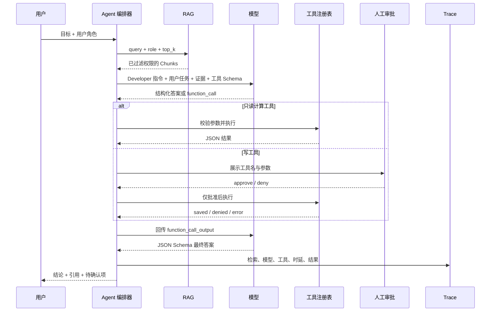

# 架构说明：为什么是工作流骨架，而不是“全自动 Agent”

## 一句话架构

确定性代码控制“能看什么、能做什么、做几次、何时确认”；模型负责“理解用户意图、选择
被允许的工具、组织有证据的答案”。

## 模块职责

### `rag.py`

- 解析 Markdown 与元数据。
- 按标题和字符窗口分块。
- 对中英混合文本做轻量分词。
- 使用 BM25 排名。
- 在评分前按 `access_roles` 过滤。

教学版没有向量数据库，是为了先看清检索机制。以后换 Embedding + 向量数据库时，
`KnowledgeBase.search()` 的输入输出契约可以保持不变。

### `prompts.py`

- 把长期规则放在 Developer 指令。
- 把本次任务、角色和证据放在 User 输入。
- 用 `<SOURCE>` 区分“资料”和“指令”。
- 用 JSON Schema 约束最终输出。
- 用 `PROMPT_VERSION` 支持 Trace 与回归。

### `tools.py`

- `calculate_priority_score` 是只读确定性工具。
- `save_analysis_draft` 是会改变状态的写工具。
- 每个工具都有名称、用途、JSON 参数 Schema 和风险等级。
- 写风险由应用层审批，不能只靠 Prompt 请求模型“自觉”。

### `agent.py`

- 负责 Observe–Plan–Act 循环。
- 保存模型输出，并把工具结果用 `call_id` 回传。
- 最大循环次数为 4，避免无限调用。
- 对最终 JSON 做应用层二次校验。

### `model.py`

- `MockResponsesClient` 提供免费、确定性的开发基线。
- `OpenAIResponsesClient` 使用 HTTP POST、Bearer 鉴权和 JSON。
- 模型适配与业务编排分离，方便更换供应商或模型。

### `trace.py`

- 每次运行生成 `run_id`。
- 记录检索、模型轮次、工具与最终状态。
- 对常见敏感字段做脱敏。
- JSONL 便于后续用 SQL、Python 或日志平台分析。

### `evaluation.py`

- 从 `golden.jsonl` 读取固定测试集。
- 检查状态、检索来源、工具选择、禁止说法、引用能否解析。
- Prompt、模型、知识库或代码改变后都运行同一套回归。

## Workflow、普通调用与 Agent 的边界

| 方案 | 适合 | 不适合 |
|---|---|---|
| 规则 | 条件固定、可枚举、错误代价高 | 自然语言理解和开放式总结 |
| 固定 Workflow | 步骤稳定，但某些步骤需要模型 | 任务路径高度不可预测 |
| 有边界 Agent | 需要模型动态选择少量工具 | 无审批的高风险生产操作 |
| 完全自主 Agent | 低风险探索、结果可逆、容错高 | 财务、权限、删除、对外发送 |

本项目属于“固定骨架 + 有边界 Agent”：检索一定先发生，模型可以决定是否调用两个工具，
写工具仍由人控制。

## 后续演进判断

不要因为技术新就升级。只有出现可测问题时再改变：

- 关键词/BM25 召回不足：加入 Embedding 和混合检索。
- Top-K 包含大量近似但无用文档：加入重排序。
- 文档太长：改进 Chunk、摘要与上下文压缩。
- 工具选择错误：先改描述、Schema 和测试，再考虑微调。
- 多领域工具过多：先做路由或 Tool Search，再考虑 Multi-Agent。
- 单 Agent 上下文互相污染：才考虑按角色拆 Agent。
